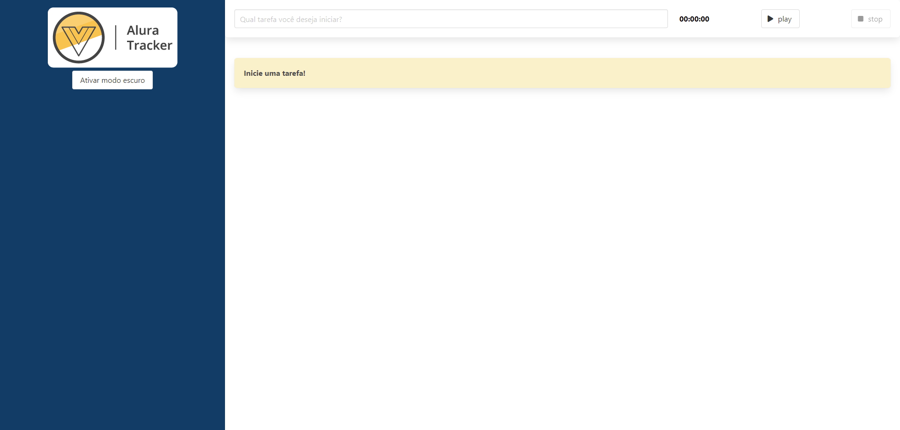
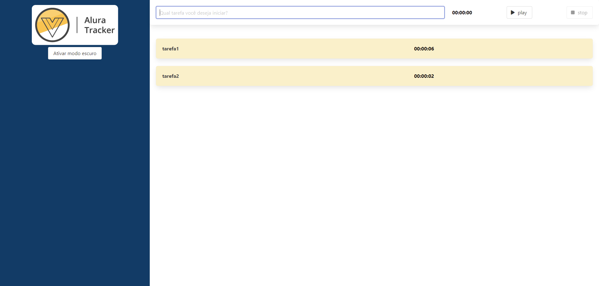

# tracker

Projeto criado durante o curso [Vue3: explorando o framework](https://cursos.alura.com.br/course/vue3-comecando-framework), da Alura.

Você pode ver o resultado final [aqui](https://tracker-vue-ashen.vercel.app/).

